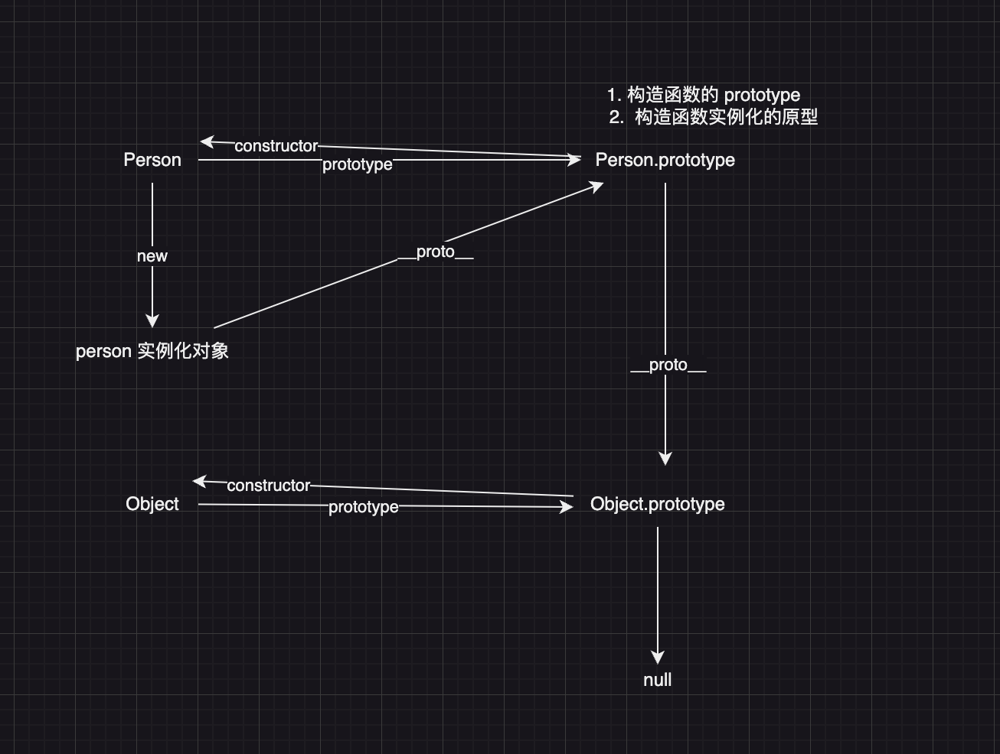

## 原型、原型链

- 原型
  - 每一个构造函数上都有一个 `prototype` 属性，来指向实例化对象的原型，同时`prototype.constructor`指回构造函数，这就是原型
- 原型链

  - 当访问实例对象上的属性时，会检测实例对象上有没有该属性，如果没有的话会通过实例对象上的`__proto__`属性，从 prototype 上去查找，如果实例对象的原型`prototype`上也没有该属性，会继续从`prototype的__proto__`上层层查找，直到找到 Object 构造函数的`prototype`上，如果没有的话继续通过`__proto__`查找，直到 null，这就是原型链

- 

## 作用域

- 静态作用域（定义时） 动态作用域（调用时）
- 什么是作用域
  - 源代码能定义变量的区域

## 执行上下文

```js
// demo1
var foo = function () {
  console.log('foo1')
}
foo()
var foo = function () {
  console.log('foo2')
}
foo()
// foo1
// foo2

// demo2
function foo() {
  console.log('foo1')
}
foo()
function foo() {
  console.log('foo2')
}
foo()
// foo2
// foo2

// demo3
console.log(add2(1, 2))
function add2(a, b) {
  return a + b
}
console.log(add1(1, 2))
var add1 = function (a, b) {
  return a + b
}
// 3 报错(add1 is not a function)
```

- execute code

  - 全局代码
  - 函数代码

### 执行上下文栈

- execution context stack ECS

```js
ECStrack = [globalContext]
```

## 闭包

- 能够访问到自由变量的函数
- 执行上下文中的两大概念：

  1. 作用于链
  2. 变量对象

- 优点: 属性获取方式便捷
- 缺点：因为太便捷，不能明确判断变量是否在用，所以会导致可能不会被回收

## 参数传递

- 按值传递
- 按引用传递
  - 指针传递

## call、apply、bind

```js
// 在使用一个指定的 this 值和若干个指定的参数值的前提下调用某个函数或方法。
// call: 改变this指向，可以传递多个参数，不传递this时默认指向window
// apply: 改变this指向，传递一个数组
// bind: 返回一个改变this指向后的函数，且永久改变this指向
fn.call(this, arg1, arg2)
const obj = {
  value: 1
}
const bar = function () {}
Function.prototype.call2 = function (context) {
  let context = context || window
  const args = [...arguments].slice(1)
  const symbol = Symbol()
  context[symbol] = this
  const results = context[symbol](...args)
  delete context[symbol]
  return results
}
fn.apply(this, ['1', '2'])

Function.prototype.apply = function (context, args) {
  let context = context || window
  const symbol = Symbol()
  context[symbol] = this
  const results = context[symbol](...args)
  delete context[symbol]
  return results
}

Function.prototype.bind2 = function (context, ...args) {
  let _this = this

  let fNOP = function () {}
  const fBound =  function (...returnArgs) {
    _this.apply(this instanceOf fBound ? this: context, [...args, ...returnArgs])
  }
  fNOP.prototype = this.prototype
  fBound.prototype = new fNOP()
  return fBound
}
```

## new

1. 返回对象，返回构造函数 prototype 上的属性

```javascript
function objectFactory() {
  const obj = new Object()
  let Constructor = [].shift.call(arguments)

  obj.__proto__ = Constructor.prototype

  const result = Constructor.apply(this, arguments)
  return typeof result === 'object' ? result : obj
}
```

## promise

### basic

```javascript
// basic
class MyPromise {
  constructor(executor) {
    this.status = 'pending'
    this.value = undefined

    const resolve = (value) => {
      if (this.status === 'pending') {
        this.status = 'resolved'
        this.value = value
      }
    }
    const reject = (error) => {
      if (this.status === 'pending') {
        this.status = 'rejected'
        this.value = error
      }
    }
    try {
      executor(resolve, reject)
    } catch (error) {
      reject(error)
    }
  }
}
```

### then

```javascript
class MyPromise {
  constructor(executor) {
    this.status = 'pending'
    this.value = undefined
    this.onFulfilledCallbacks = []
    this.onRejectedCallbacks = []

    const resolve = (value) => {
      if (this.status === 'pending') {
        this.status = 'fulfilled'
        this.value = value

        while (this.onFulfilledCallbacks.length > 0) {
          this.onFulfilledCallbacks.shift()(this.value)
        }
      }
    }

    const reject = (error) => {
      if (this.status === 'pending') {
        this.status = 'rejected'
        this.value = error

        while (this.onRejectedCallbacks.length) {
          this.onRejectedCallbacks.shift()(this.value)
        }
      }
    }

    executor(resolve, reject)
  }

  // 链式调用
  // 两个callback
  // 定时器
  then(onFulfilled, onRejected) {
    // 确保为函数
    typeof onFulfilled === 'function' ? onFulfilled : (val) => val
    typeof onRejected === 'function' ? onRejected : (val) => val

    const resolvePromise = new MyPromise((resolve, reject) => {
      const fn = (cb) => {
        let cbResult = cb(this.value)
        if (cbResult instanceof MyPromise) {
          cbResult.then(resolve, reject)
        } else {
          resolve(cbResult)
        }
      }

      if (this.status === 'fulfilled') {
        fn(onFulfilled)
      } else if (this.status === 'rejected') {
        fn(onRejected)
      } else if (this.status === 'pending') {
        this.onFulfilledCallbacks.push(() => fn(onFulfilled))
        this.onRejectedCallbacks.push(() => fn(onRejected))
      }
    })
    return resolvePromise

    // return resolvePromise
    // if (this.status === 'fulfilled') {
    //   onFulfilled(this.value)
    // } else if (this.status === 'rejected') {
    //   onRejected(this.value)
    // } else if (this.status === 'pending') {
    //   this.onFulfilledCallbacks.push(onFulfilled)
    //   this.onRejectedCallbacks.push(onRejected)
    // }
  }
}

const test2 = new MyPromise((resolve, reject) => {
  setTimeout(() => {
    resolve('success') // 1秒后输出 success
  }, 1000)
}).then(
  (res) => console.log(res),
  (err) => console.log(err)
)

// 链式调用 输出 200
const p3 = new Promise((resolve, reject) => {
  resolve(100)
})
  .then(
    (res) => 2 * res,
    (err) => console.log(err)
  )
  .then(
    (res) => console.log(res),
    (err) => console.log(err)
  )

// 链式调用 输出300
const p4 = new Promise((resolve, reject) => {
  resolve(100)
})
  .then(
    (res) => new Promise((resolve, reject) => resolve(3 * res)),
    (err) => console.log(err)
  )
  .then(
    (res) => console.log(res),
    (err) => console.log(err)
  )

// console.log('🚀 ~ p1 ~ p1:', p1)
```

### all

```javascript
const all = () => {
  const promiseList = []
  let count = 0
  return new MyPromise((resolve, reject) => {
    const addData = (res, index) => {
      promiseList[index] = res
      count++
      if (index === promiseList.length) {
        resolve(promiseList)
      }
    }
    promiseList.forEach((promise, index) => {
      if (promise instanceof MyPromise) {
        promise.then(
          (res) => {
            addData(res, index)
          },
          (err) => reject(err)
        )
      } else {
        addData(promise, index)
      }
    })
  })
}
```

### race

```javascript
const race = (promiseList) => {
  return new MyPromise((resolve, reject) => {
    promiseList.forEach((promise, index) => {
      if (promise instanceof MyPromise) {
        promise.then(
          (res) => {
            resolve(res)
          },
          (err) => reject(err)
        )
      } else {
        resolve(promise)
      }
    })
  })
}
```

### allSettled

- 成功记录成功的结果 失败记录失败的结果

```javascript
const allSettled = (promiseList) => {
  return new MyPromise((resolve, reject) => {
    let result = []
    let count = 0

    const addData = (value, index, status) => {
      result[index] = {
        status,
        value
      }
      count++
      if (count === result.length) {
        resolve(result)
      }
    }
    promiseList.forEach((promise, index) => {
      if (promise instanceof MyPromise) {
        promise.then(
          (res) => {
            addData(res, index, 'fulfilled')
          },
          (err) => {
            addData(err, index, 'rejected')
          }
        )
      } else {
        addData(promise, index, 'fulfilled')
      }
    })
  })
}
```

### any

- 任意一个成功就返回成功

```javascript
const any = (promiseList) => {
  return new Promise((resolve, reject) => {
    let count = 0
    promiseList.forEach((promise, index) => {
      if (promise instanceof MyPromise) {
        promise.then(
          (res) => {
            resolve(res)
          },
          (err) => {
            count++
            if (count === promiseList.length) {
              reject(err)
            }
          }
        )
      }
    })
  })
}
```

### async await

### generator

```javascript
// yield 暂停点 能够提供暂停的能力
function* gen() {
  yield 1
  yield 2
  yield 3
}
let g = gen()
console.log(g.next()) // { value: 1, done: false }
console.log(g.next()) // { value: 2, done: false }
console.log(g.next()) // { value: 3, done: false }
console.log(g.next()) // { value: undefined, done: true }
```

## 不新建第三方变量 交换两个变量的值

```javascript
let a = 1
let b = ((2)[(a, b)] = [b, a])
```

## 防抖

```javascript
function debounce(fn, delay = 200) {
  let timer = null
  return function () {
    const _this = this
    const args = [...arguments]
    if (timer) return
    timer = setTimeout(() => {
      fn.apply(_this, args)
    }, delay)
  }
}
```

## 节流

```javascript
function throttle(fn, delay = 200) {
  let timer = null
  const _this = this
  return function () {
    timer = setTimeout(() => {
      timer = null
      fn.call(_this, arguments)
    }, delay)
  }
}
```

## let const var

```js
// var 的话会将变量提升到顶层，与解析结果是 undefined
// let const 不能被预解析提前调用的话会报错

// var 可以重复声明变量，会重新赋值
// let const 不能重复，

// var 每次循环时都会对这一个变量进行重新赋值，会覆盖，导致存储的是最终循环变量的值
// let 循环时相当于触发了 一个代码块，每个代码块就是一个单独的独立作用域 不会覆盖之前的值

// var声明的循环变量
```

## 深浅拷贝

- 浅拷贝 拷贝的是 值的引用地址
- 深拷贝 会忽略 undefined function
  - 数组的拷贝
  - 对象的拷贝

## 继承
