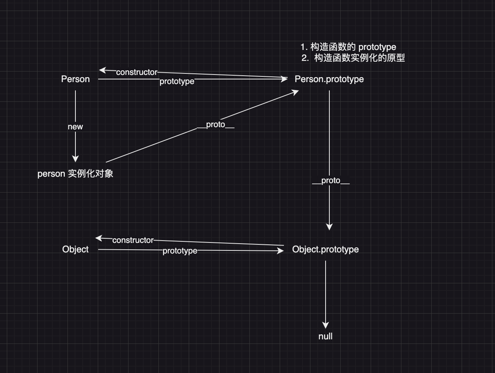

## 原型、原型链

- 原型
  - 每一个构造函数上都有一个 `prototype` 属性，来指向实例化对象的原型，同时`prototype.constructor`指回构造函数，这就是原型
- 原型链

  - 当访问实例对象上的属性时，会检测实例对象上有没有该属性，如果没有的话会通过实例对象上的`__proto__`属性，从 prototype 上去查找，如果实例对象的原型`prototype`上也没有该属性，会继续从`prototype的__proto__`上层层查找，直到找到 Object 构造函数的`prototype`上，如果没有的话继续通过`__proto__`查找，直到 null，这就是原型链

- 
