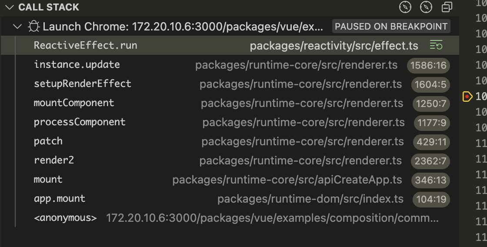

<!--
pauseTracking 和 pauseScheduling 函数用于暂停响应式追踪和调度，避免在修改数组长度时产生无限循环。
resetTracking 和 resetScheduling 函数用于重置追踪和调度状态。
 -->

## ref

首先是分为`ref`和`shallowRef`
在调用时都是通过`createRef【1.1】`实例化`RefImpl[1.2]`类，在其中通过`trackRefValue`进行依赖收集，`triggerRefValue`触发依赖，收集过程在`effect.ts`

```ts
// 1.1
function createRef(rawValue: unknown, shallow: boolean) {
  if (isRef(rawValue)) {
    return rawValue
  }
  return new RefImpl(rawValue, shallow)
}
```

```ts
// 1.2
class RefImpl<T> {
  private _value: T
  private _rawValue: T

  public dep?: Dep = undefined
  public readonly __v_isRef = true

  constructor(value: T, public readonly __v_isShallow: boolean) {
    this._rawValue = __v_isShallow ? value : toRaw(value)
    this._value = __v_isShallow ? value : toReactive(value)
  }

  get value() {
    trackRefValue(this)
    return this._value
  }

  set value(newVal) {
    const useDirectValue =
      this.__v_isShallow || isShallow(newVal) || isReadonly(newVal)
    newVal = useDirectValue ? newVal : toRaw(newVal)
    if (hasChanged(newVal, this._rawValue)) {
      this._rawValue = newVal
      this._value = useDirectValue ? newVal : toReactive(newVal)
      triggerRefValue(this, DirtyLevels.Dirty, newVal)
    }
  }
}
```

## reactive

- packages/reactivity/src/reactive.ts

  首先是分为`shallowReactive`、`readonly`、`shallowReadonly`、`reactive`,通过`createReactiveObject[2.1]`
  根据不同的创建方式 执行不同的`baseHandlers`、`collectionHandlers[2.2]`，

<!-- 在`baseHandlers`中通过`get`、`set`进行依赖收集、触发依赖，收集过程在`effect.ts` -->

```ts
// 2.1
// WeakMap 对内存的回收更加友好
export const reactiveMap = new WeakMap<Target, any>()
export const shallowReactiveMap = new WeakMap<Target, any>()
export const readonlyMap = new WeakMap<Target, any>()
export const shallowReadonlyMap = new WeakMap<Target, any>()

export function reactive(target: object) {
  // 如果是只读的，则直接返回
  if (isReadonly(target)) {
    return target
  }
  return createReactiveObject(
    target,
    false,
    mutableHandlers,
    mutableCollectionHandlers,
    reactiveMap
  )
}

// target 目标对象
// isReadonly 是否只读
// baseHandlers 基础处理器
// collectionHandlers 集合处理器
// proxyMap 响应式对象缓存
function createReactiveObject(
  target: Target,
  isReadonly: boolean,
  baseHandlers: ProxyHandler<any>,
  collectionHandlers: ProxyHandler<any>,
  proxyMap: WeakMap<Target, any>
) {
  // 不是个对象直接返回
  if (!isObject(target)) {
    if (__DEV__) {
      warn(`value cannot be made reactive: ${String(target)}`)
    }
    return target
  }
  // target is already a Proxy, return it.
  // exception: calling readonly() on a reactive object
  if (
    target[ReactiveFlags.RAW] &&
    !(isReadonly && target[ReactiveFlags.IS_REACTIVE])
  ) {
    return target
  }
  //  该对象是不是已经是一个响应式对象
  const existingProxy = proxyMap.get(target)
  if (existingProxy) {
    return existingProxy
  }
  // only specific value types can be observed.
  const targetType = getTargetType(target)

  //getTargetType -> 获取原始类型 Object.prototype.toString().slice(8, -1)
  if (targetType === TargetType.INVALID) {
    return target
  }
  // 将对象转为响应式对象
  const proxy = new Proxy(
    target,
    targetType === TargetType.COLLECTION ? collectionHandlers : baseHandlers
  )
  // 缓存代理对象
  proxyMap.set(target, proxy)
  return proxy
}
```

## baseHandlers

- packages/reactivity/src/baseHandlers.ts

  baseHandles 分为四种 handles，对其进行不同的操作
  在`mutableHandlers【3.1】`是通过 `new MutableReactiveHandler()` 继承了`BaseReactiveHandler`,拦截了 get 操作，`track`进行依赖收集，通过 key 判断了：是否是响应式对象、只读对象、浅层响应式对象
  如果是数组的话，通过 Object.prototype.hasOwnProperty.call(target, key)判断是否是数组，如果是数组，则通过`arrayInstrumentations【3.2】`进行操作

`arrayInstrumentations:` 对于 includes、indexOf 和 lastIndexOf 这三个方法，会先调用 toRaw 将数组转换为原始值，然后进行响应式追踪（track），最后执行原始方法。如果原始方法返回 -1 或 false，则再次使用原始值执行该方法
对于 push、pop、shift、unshift、splice，会暂停响应式追踪和调度（pauseTracking 和 pauseScheduling），执行原始方法后，重置追踪和调度（resetTracking 和 resetScheduling）。

```js
import {
  mutableHandlers,
  readonlyHandlers,
  shallowReactiveHandlers,
  shallowReadonlyHandlers
} from './baseHandlers'
```

```ts
class BaseReactiveHandler implements ProxyHandler<Target> {
  constructor(
    protected readonly _isReadonly = false, // 代理对象是否只读
    protected readonly _isShallow = false // 代理对象是否是浅层代理
  ) {}

  get(target: Target, key: string | symbol, receiver: object) {
    // 判断了key 是否是响应式对象、只读对象、浅层响应式对象
    const isReadonly = this._isReadonly,
      isShallow = this._isShallow
    if (key === ReactiveFlags.IS_REACTIVE) {
      return !isReadonly
    } else if (key === ReactiveFlags.IS_READONLY) {
      return isReadonly
    } else if (key === ReactiveFlags.IS_SHALLOW) {
      return isShallow
    } else if (key === ReactiveFlags.RAW) {
      if (
        receiver ===
          (isReadonly
            ? isShallow
              ? shallowReadonlyMap
              : readonlyMap
            : isShallow
            ? shallowReactiveMap
            : reactiveMap
          ).get(target) ||
        // receiver is not the reactive proxy, but has the same prototype
        // this means the reciever is a user proxy of the reactive proxy
        Object.getPrototypeOf(target) === Object.getPrototypeOf(receiver)
      ) {
        return target
      }
      // early return undefined
      return
    }

    const targetIsArray = isArray(target)

    if (!isReadonly) {
      if (targetIsArray && hasOwn(arrayInstrumentations, key)) {
        return Reflect.get(arrayInstrumentations, key, receiver)
      }
      if (key === 'hasOwnProperty') {
        return hasOwnProperty
      }
    }

    const res = Reflect.get(target, key, receiver)

    if (isSymbol(key) ? builtInSymbols.has(key) : isNonTrackableKeys(key)) {
      return res
    }

    if (!isReadonly) {
      track(target, TrackOpTypes.GET, key)
    }

    if (isShallow) {
      return res
    }

    if (isRef(res)) {
      // ref unwrapping - skip unwrap for Array + integer key.
      return targetIsArray && isIntegerKey(key) ? res : res.value
    }

    if (isObject(res)) {
      // Convert returned value into a proxy as well. we do the isObject check
      // here to avoid invalid value warning. Also need to lazy access readonly
      // and reactive here to avoid circular dependency.
      return isReadonly ? readonly(res) : reactive(res)
    }

    return res
  }
}
```

```ts
// mutableHandlers
// 3.1
export const mutableHandlers: ProxyHandler<object> =
  /*#__PURE__*/ new MutableReactiveHandler()

class MutableReactiveHandler extends BaseReactiveHandler {
  constructor(isShallow = false) {
    super(false, isShallow)
  }

  set(
    target: object,
    key: string | symbol,
    value: unknown,
    receiver: object
  ): boolean {
    let oldValue = (target as any)[key]
    if (!this._isShallow) {
      const isOldValueReadonly = isReadonly(oldValue)
      if (!isShallow(value) && !isReadonly(value)) {
        oldValue = toRaw(oldValue)
        value = toRaw(value)
      }
      if (!isArray(target) && isRef(oldValue) && !isRef(value)) {
        if (isOldValueReadonly) {
          return false
        } else {
          oldValue.value = value
          return true
        }
      }
    } else {
      // in shallow mode, objects are set as-is regardless of reactive or not
    }

    const hadKey =
      isArray(target) && isIntegerKey(key)
        ? Number(key) < target.length
        : hasOwn(target, key)
    const result = Reflect.set(target, key, value, receiver)
    // don't trigger if target is something up in the prototype chain of original
    if (target === toRaw(receiver)) {
      if (!hadKey) {
        trigger(target, TriggerOpTypes.ADD, key, value)
      } else if (hasChanged(value, oldValue)) {
        trigger(target, TriggerOpTypes.SET, key, value, oldValue)
      }
    }
    return result
  }

  deleteProperty(target: object, key: string | symbol): boolean {
    const hadKey = hasOwn(target, key)
    const oldValue = (target as any)[key]
    const result = Reflect.deleteProperty(target, key)
    if (result && hadKey) {
      trigger(target, TriggerOpTypes.DELETE, key, undefined, oldValue)
    }
    return result
  }

  has(target: object, key: string | symbol): boolean {
    const result = Reflect.has(target, key)
    if (!isSymbol(key) || !builtInSymbols.has(key)) {
      track(target, TrackOpTypes.HAS, key)
    }
    return result
  }
  ownKeys(target: object): (string | symbol)[] {
    track(
      target,
      TrackOpTypes.ITERATE,
      isArray(target) ? 'length' : ITERATE_KEY
    )
    return Reflect.ownKeys(target)
  }
}
```

```ts
// arrayInstrumentations
// 3.2
const arrayInstrumentations = /*#__PURE__*/ createArrayInstrumentations()

function createArrayInstrumentations() {
  const instrumentations: Record<string, Function> = {}
  // instrument identity-sensitive Array methods to account for possible reactive
  // values
  ;(['includes', 'indexOf', 'lastIndexOf'] as const).forEach((key) => {
    instrumentations[key] = function (this: unknown[], ...args: unknown[]) {
      const arr = toRaw(this) as any
      for (let i = 0, l = this.length; i < l; i++) {
        track(arr, TrackOpTypes.GET, i + '')
      }
      // we run the method using the original args first (which may be reactive)
      const res = arr[key](...args)
      if (res === -1 || res === false) {
        // if that didn't work, run it again using raw values.
        return arr[key](...args.map(toRaw))
      } else {
        return res
      }
    }
  })
  // instrument length-altering mutation methods to avoid length being tracked
  // which leads to infinite loops in some cases (#2137)
  ;(['push', 'pop', 'shift', 'unshift', 'splice'] as const).forEach((key) => {
    instrumentations[key] = function (this: unknown[], ...args: unknown[]) {
      pauseTracking()
      pauseScheduling()
      const res = (toRaw(this) as any)[key].apply(this, args)
      resetScheduling()
      resetTracking()
      return res
    }
  })
  return instrumentations
}
```

## reactiveEffect

在 baseHandles 中，出现了大量的`track`、`trigger`，比如

```ts
// track
if (!isReadonly) {
  track(target, TrackOpTypes.GET, key)
}

// trigger
deleteProperty(target: object, key: string | symbol): boolean {
  const hadKey = hasOwn(target, key)
  const oldValue = (target as any)[key]
  const result = Reflect.deleteProperty(target, key)
  if (result && hadKey) {
    trigger(target, TriggerOpTypes.DELETE, key, undefined, oldValue)
  }
  return result
}
```

通过追踪 track trigger，可以在其中也是执行的是
当模版中有使用到对应的变量后，会先走 track 进行依赖收集
给 targetMap(全局)存储 target 目标对象和对应的依赖映射(depsMap)，如果没有依赖映射的话，则创建一个新的映射并存储在 trackMap 中

```ts
// /core/packages/reactivity/src/reactiveEffect.ts

import {
  activeEffect,
  pauseScheduling,
  resetScheduling,
  shouldTrack,
  trackEffect,
  triggerEffects
} from './effect'

type KeyToDepMap = Map<any, Dep>
const targetMap = new WeakMap<object, KeyToDepMap>()

export function track(target: object, type: TrackOpTypes, key: unknown) {
  if (shouldTrack && activeEffect) {
    let depsMap = targetMap.get(target)
    if (!depsMap) {
      // 第一次默认 depsMap = undefined  给set 同时给 depsMap 设置为 new Map()
      targetMap.set(target, (depsMap = new Map()))
    }
    let dep = depsMap.get(key)
    if (!dep) {
      // 给 depsMap 设置key，value值为 {cleanup:() => depsMap!.delete(key),computed: undefined }
      depsMap.set(key, (dep = createDep(() => depsMap!.delete(key))))
    }
    trackEffect(
      activeEffect,
      dep,
      __DEV__
        ? {
            target,
            type,
            key
          }
        : void 0
    )
  }
}

export const createDep = (
  cleanup: () => void,
  computed?: ComputedRefImpl<any>
): Dep => {
  const dep = new Map() as Dep
  dep.cleanup = cleanup
  dep.computed = computed
  return dep
}

export function trigger(
  target: object,
  type: TriggerOpTypes,
  key?: unknown,
  newValue?: unknown,
  oldValue?: unknown,
  oldTarget?: Map<unknown, unknown> | Set<unknown>
) {
  const depsMap = targetMap.get(target)
  if (!depsMap) {
    // never been tracked
    return
  }

  let deps: (Dep | undefined)[] = []
  if (type === TriggerOpTypes.CLEAR) {
    // collection being cleared
    // trigger all effects for target
    deps = [...depsMap.values()]
  } else if (key === 'length' && isArray(target)) {
    const newLength = Number(newValue)
    depsMap.forEach((dep, key) => {
      if (key === 'length' || (!isSymbol(key) && key >= newLength)) {
        deps.push(dep)
      }
    })
  } else {
    // schedule runs for SET | ADD | DELETE
    if (key !== void 0) {
      deps.push(depsMap.get(key))
    }

    // also run for iteration key on ADD | DELETE | Map.SET
    switch (type) {
      case TriggerOpTypes.ADD:
        if (!isArray(target)) {
          deps.push(depsMap.get(ITERATE_KEY))
          if (isMap(target)) {
            deps.push(depsMap.get(MAP_KEY_ITERATE_KEY))
          }
        } else if (isIntegerKey(key)) {
          // new index added to array -> length changes
          deps.push(depsMap.get('length'))
        }
        break
      case TriggerOpTypes.DELETE:
        if (!isArray(target)) {
          deps.push(depsMap.get(ITERATE_KEY))
          if (isMap(target)) {
            deps.push(depsMap.get(MAP_KEY_ITERATE_KEY))
          }
        }
        break
      case TriggerOpTypes.SET:
        if (isMap(target)) {
          deps.push(depsMap.get(ITERATE_KEY))
        }
        break
    }
  }

  pauseScheduling()
  for (const dep of deps) {
    if (dep) {
      triggerEffects(
        dep,
        DirtyLevels.Dirty,
        __DEV__
          ? {
              target,
              type,
              key,
              newValue,
              oldValue,
              oldTarget
            }
          : void 0
      )
    }
  }
  resetScheduling()
}
```

## effect

- packages/reactivity/src/effect.ts
  - 01 进入 trackEffect 没有发现源头 从新 debug

<!-- packages/runtime-core/src/renderer.ts -->

```ts
export function trackEffect(
  effect: ReactiveEffect,
  dep: Dep,
  debuggerEventExtraInfo?: DebuggerEventExtraInfo
) {
  if (dep.get(effect) !== effect._trackId) {
    // 如果依赖不存在集合中，则添加
    dep.set(effect, effect._trackId)
    const oldDep = effect.deps[effect._depsLength]
    if (oldDep !== dep) {
      if (oldDep) {
        cleanupDepEffect(oldDep, effect)
      }
      effect.deps[effect._depsLength++] = dep
    } else {
      effect._depsLength++
    }
    if (__DEV__) {
      effect.onTrack?.(extend({ effect }, debuggerEventExtraInfo!))
    }
  }
}
```

- 执行流程在

packages/runtime-core/src/renderer.ts -> baseCreateRenderer()

- 02 依赖收集的过程也就是从

  - 挂载的时候从 template render（\_createCommentVNode） 中去收集用到的一些变量，通过 new ReactiveEffect 初始化，在`baseHandles`中进行 track,通过 trackEffect 将当前副作用（effect）添加到其依赖的集合中，并处理依赖集合的更新。并将对应的索引进行自增

```ts
const effect = (instance.effect = new ReactiveEffect(
  componentUpdateFn,
  NOOP,
  () => queueJob(update),
  instance.scope // track it in component's effect scope
))

const update: SchedulerJob = (instance.update = () => {
  if (effect.dirty) {
    effect.run()
  }
})
```

```ts
// ReactiveEffect
export class ReactiveEffect<T = any> {
  active = true
  deps: Dep[] = [] // 存储 effect 的依赖项
  computed?: ComputedRefImpl<T> // 是否是一个计算属性
  allowRecurse?: boolean // 是否允许递归
  onStop?: () => void // effect 停止的时候调用
  onTrack?: (event: DebuggerEvent) => void // effect 被追踪的时候调用
  onTrigger?: (event: DebuggerEvent) => void // effect 被触发的时候调用
  _dirtyLevel = DirtyLevels.Dirty
  _trackId = 0 // effect 的追踪 ID
  _depsLength = 0 // effect 的依赖项数量
  _runnings = 0
  _shouldSchedule = false
  _depsLength = 0

  constructor(
    public fn: () => T,
    public trigger: () => void,
    public scheduler?: EffectScheduler,
    scope?: EffectScope
  ) {
    recordEffectScope(this, scope)
  }
  // xxxx
  run() {
    this._dirtyLevel = DirtyLevels.NotDirty
    if (!this.active) {
      return this.fn()
    }
    let lastShouldTrack = shouldTrack
    let lastEffect = activeEffect
    try {
      shouldTrack = true
      activeEffect = this
      this._runnings++
      preCleanupEffect(this)
      return this.fn()
    } finally {
      postCleanupEffect(this)
      this._runnings--
      activeEffect = lastEffect
      shouldTrack = lastShouldTrack
    }
  }

  stop() {
    if (this.active) {
      preCleanupEffect(this)
      postCleanupEffect(this)
      this.onStop && this.onStop()
      this.active = false
    }
  }
}
```


