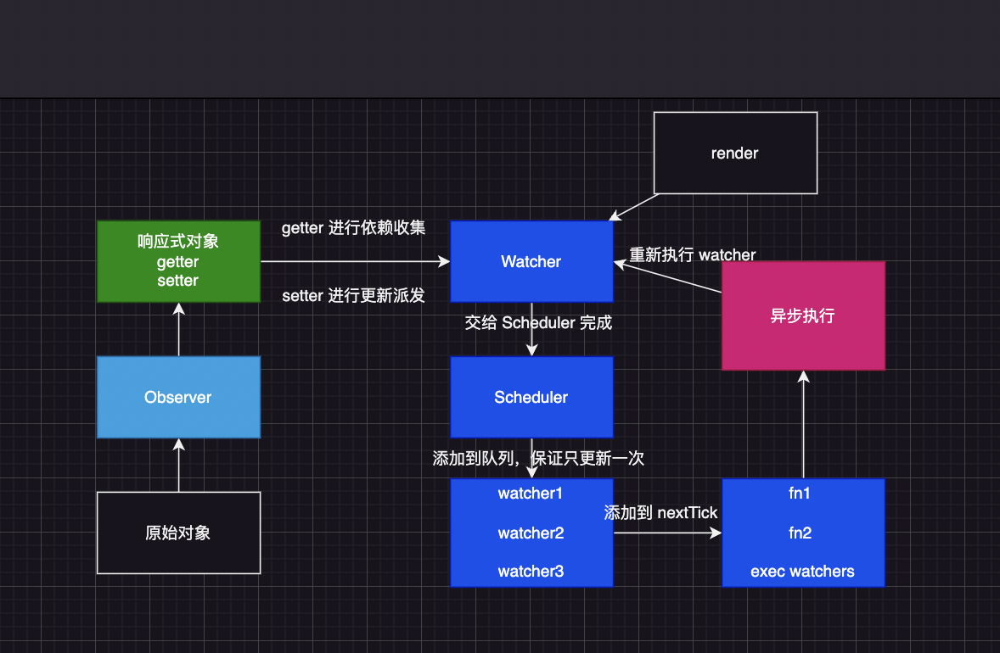

## Vue3 对比 Vue2 有什么变化

我觉得可以分为大概四类

1. `源码层面的优化`
2. `性能方面的优化`
3. `API 语法方面的优化`
4. `引入了 SFC`

- 源码层面的优化体现在 使用 typescript 重构了整个 vue 的源码，对冷门的功能进行了删除（filters、inline-template），并且将源码的整个结构改为了 monorepo 进行多包管理，这样的话颗粒度更细，将不同的包进行独立测试发布，可以单独引入某个包进行使用，而不用必须引入 vue
- 性能上的优化体现在响应式优化、diff 算法、模版编译优化，不过性能上的优化无法直接感知，只能是通过源码阅读去了解，真正能感知到的是语法上的优化 例如 composition API 替代 options API，可以让一块功能更加集中，无论是在阅读还是在修改方面更便捷，另外的话也解决了 mixin 逻辑复用的问题（比如说命名空间、数据来源不清晰等问题）
- 最后就是引入了 SFC，SFC 也就是听取社区的提案，通过和社区讨论某个功能及特性要修改动机原因这些

<!-- - `源码上的更新和优化`
  - Monorepo
    - vue2 源码是托管在 src 目录下，根据功能拆分出来 compiler(编译器)、core(和平台无关通用运行时代码)
    - vue3 采用 Monorepo 的形式，将模块分到了不同的包里，每个包都有各自的 API、进行类型定义以及测试。这样颗粒度更细，责任划分更加明确
  - ts 支持
    - vue 纯 js，没有类型开发，无类型系统的校验
    - vue2 是使用 flow js 进行类型系统的校验（Facebook 提出的类型系统）
    - vue3 是使用的 typescript
- `性能上的优化`

  - 代码体积缩小
    - 移除冷门功能（filter、inline-template）
    - 生产环境采用 rollup 进行构建，利用 tree-shaking 较少用户代码的体积
  - 数据劫持优化
    - vue2 Object.defineProperty
    - vue3 proxy
  - 编译优化
    1. 静态提升
    2. 预字符串化
    3. 缓存事件处理函数
    4. block tree
    5. patchFlag
  - diff 算法优化
    1. vue2 双端 diff
    2. vue3 快速 diff

- `语法 API 的优化`

  - options API
  - options API + composition API（推荐）

    - composition API 的优点
      - 查看一个功能的时候，不需要在文件上下反复横跳；并且代码风格可服用的颗粒度更细

  - 优化逻辑服用

    - mixins 缺点
      - 不清晰的数据来源
      - 命名空间的冲突
      - 隐士的跨 mixin 通信

  - vue2 是通过 new 实例化创建应用，缺点是如果一个页面存在多个 vue 应用，部分配置会影响所有的 Vue 应用（Vue.use）
  - vue3 是通过 createApp(根组件).use 互不影响

- `引入 RFC`
  - request for comments 这是一种在软件开发和开源项目中常用的提案流程，用于收集社区对某个新功能、改动或标准的意见和建议
- RFC 是一种文档格式，它详细的描述了某个特性或更改的建议，讨论其动机、设计选择、细节实现以及潜在的影响。
  在通过讨论和反馈达成共识后，RFC 会被采纳或者拒绝
- 一份 RFC 主要的组成有
  1. 标题：简单描述提案的目的
  2. 摘要：简要说明天的内容和动机
  3. 动机：解决为什么需要这个提案，解决了什么问题
  4. 详细设计: 深入描述提案的设计和实现细节
  5. 潜在的问题和代替方案: 讨论可能存在的问题和可以考虑的替代方案
  6. 不兼容的变更: 描述提案是否会引入不兼容的变更，以及变更后的影响

// 通过 RFC，vue 的核心团队能更好的听取用户建议和需求，从而开发出更符合社区的功能和特性 -->

## 响应式的变化

1. 拦截的变化

   > 2: 针对对象属性的读写操作进行拦截,也就是之后新增/删除的属性是监测不到的

   > 3: 针对对象的多种操作，还可以对原型的查看，函数的调用行为也能进行的拦截

2. 创建响应式数据上的变化

   > 2: 使用 data 来创建像一个男士

   > 3: 使用 ref、reactive 来创建响应式数据

   - ref: 是使用的 Object.defineProperty

   - reactive: 是使用的 proxy

3. 依赖收集上的变化

   > 2: Watcher + Dep
   > 每个响应式属性上都有一个 Dep 实例，用于做依赖收集，内部包含了一个数组，存储这个属性所有的 Watcher

   > 3: WeakMap + Map + Set
   > 依赖收集的颗粒度更细一些
   > WeakMap 键对应的是响应式对象，值是一个 Map，这个 Map 的键是改对象的属性，值是一个 Set，Set 里面存储了所有依赖于这个属性的 effect 函数

- vue2 中的响应式工作机制

1. Observer: 发生在 beforeCreate 之后，created 之前，递归遍历对象的所有属性，深度完成属性的转换--`数据劫持` Object.defineProperty 来做数据劫持，生成 getter/setter
2. dep--`发布者`: 记录依赖，也就是数据和 watcher 之间的映射关系
3. `观察者`: watcher 会被发布者记录，在数据发生变化的时候，发布者会通知 watcher，watcher 收到后会交给 `scheduler`，放入时间循环的微队列中
4. 负责调度

<!-- - data 中的数据会被 vue 遍历成 getter 和 setter
- 每个组件实例都对应一个 watcher 实例，在渲染过程中把使用到的数据作为依赖，在依赖项的 setter 触发时，会通知 watcher，从而使它关联的组件重新渲染 -->

- vue3 的响应式工作机制

## vue2 全局构造函数带来的问题

1. 调用构造函数的静态方法会对所有 vue 应用生效，不利于不同应用之间的隔离
2. vue2 的构造函数继承了太多功能，不利于 tree-shaking
   在 vue3 中都是采用按需引入的方式来引入，充分利于 tree-shaking 来进行打包优化
3. vue2 没有把组件实例和 Vue 两个概念区分，在 vue2 中通过 new vue 创建的对象即是一个 Vue 应用，同时也是一个特殊的 vue 组件
   在 vue3 中 将两个概念给区分出来，通过 createApp 创建的对象，是一个 vue 应用，它内部提供的方法是针对中个应用的，而不是一个特殊的组件
