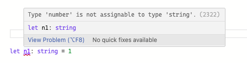

### 为什么要使用 `typescript` 捏

- 编译时提前暴露错误
- 统一代码规范、风格和质量
- 解决联调问题

编辑器一般都会有 LSP（Language Server Protocol）语言服务器协议，也就是智能提示、错误这些

```txt
ts 是编译时的强类型的静态语言
意味着任何类型错误都会在编译时发现，而不是代码运行时

静态类型: 是在编写代码的时候确定的，而不是在运行时确定的
强类型: 更加严格的类型判断

但 浏览器不能识别 ts 代码，而是要编译成 js 代码

```



<!-- ###### 类型标注

- 小写
  - 基本数据类型一般都是小写
- 大写
  - 定义一个类或构造函数的时候，类型标注应该大写字母开头 -->
