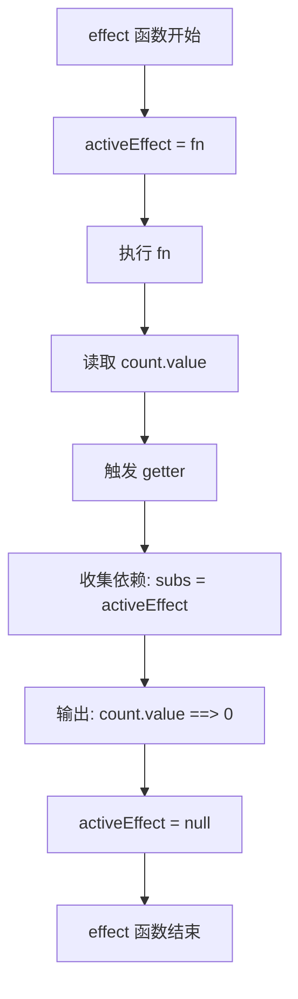
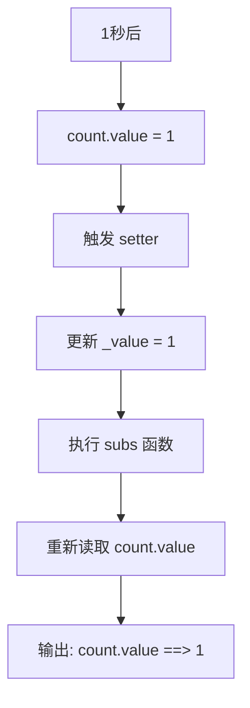

# Vue 响应式系统基础原理

## 🎯 什么是响应式？

想象一下，你有一个数字 `count`，当这个数字发生变化时，所有依赖它的地方都能自动更新。这就是响应式的核心思想！

```js
// 创建一个响应式变量
const count = ref(0)

// 当 count 变化时，这个函数会自动执行
effect(() => {
  console.log('count.value ==> ', count.value)
})

// 1秒后修改 count 的值
setTimeout(() => {
  count.value = 1
}, 1000)
```

**运行结果：**
- 进入页面输出：`count.value ==> 0`
- 一秒后输出：`count.value ==> 1`

## 🤔 核心问题

要实现响应式，我们需要解决两个关键问题：

1. **谁在使用这个变量？** - 需要知道哪些地方依赖这个变量
2. **变量修改后通知谁？** - 需要知道修改后要更新哪些地方

## 🔧 第一步：添加 getter 和 setter

为了让 `ref` 能够"感知"到读取和修改操作，我们需要使用 `getter` 和 `setter`：

```js
class RefImpl {
  _value

  constructor(value) {
    this._value = value
  }

  get value() {
    console.log('get value')  // 读取时触发
    return this._value
  }

  set value(newValue) {
    console.log('set value', newValue)  // 修改时触发
    this._value = newValue
  }
}
```

现在可以正常输出 `get value` 和 `set value`，但是还有一个问题：**我们怎么知道谁在使用这个变量，更新后需要通知谁呢？**

## 📝 第二步：追踪正在执行的 effect

我们需要一个"全局变量"来记住当前正在执行的 `effect` 函数：

```js
// effect.ts
let activeEffect = null

export function effect(fn) {
  activeEffect = fn    // 1. 记住当前正在执行的函数
  fn()                 // 2. 执行这个函数
  activeEffect = null  // 3. 执行完毕后清空
}
```

**这个函数的作用：**
1. 📌 把正在执行的 `effect` 函数存储到 `activeEffect` 变量中
2. ▶️ 执行这个函数
3. 🧹 执行完毕后把 `activeEffect` 变量清空，确保只有在 `effect` 函数执行期间，读取 `ref` 的值时才会进行依赖收集

## 🔗 第三步：建立依赖关系

现在要让 `ref` 能够：
1. **读取值时收集依赖** - 知道谁在使用我
2. **设置值时触发依赖** - 通知使用我的人更新

```js
// ref.ts
import { activeEffect } from './effect'

class RefImpl {
  _value
  // 保存依赖的 effect 函数
  subs

  constructor(value) {
    this._value = value
  }

  get value() {
    // 🔍 收集依赖：如果当前有正在执行的 effect，就记住它
    if (activeEffect) {
      this.subs = activeEffect
    }
    return this._value
  }

  set value(newValue) {
    // 🔄 触发更新：修改值后，通知依赖的 effect 重新执行
    this._value = newValue
    this.subs?.()  // 如果有关联的 effect，就执行它
  }
}

export function ref(value) {
  return new RefImpl(value)
}
```

## 🎉 完成！现在可以实现基本的响应式了

让我们总结一下整个执行流程：

```js
import { ref, effect } from '../dist/reactivity.esm.js'

const count = ref(0)

effect(() => {
  console.log('count.value ==> ', count.value)
})

setTimeout(() => {
  count.value = 1
}, 1000)
```

## 📋 详细执行流程

### 第一步：创建响应式变量
```mermaid
graph LR
    A[ref(0)] --> B[new RefImpl(0)]
    B --> C[count 变量]
```

### 第二步：注册 effect 函数


### 第三步：修改响应式变量


**用大白话解释：**

1. **🏗️ 创建阶段**：`ref(0)` 创建了一个"智能盒子"，里面装着数字 `0`

2. **📝 注册阶段**：
   - `effect` 函数说："我要监听这个盒子"
   - 当读取 `count.value` 时，盒子记住了："哦，这个函数在使用我"
   - 输出初始值：`count.value ==> 0`

3. **🔄 更新阶段**：
   - 1秒后，`count.value = 1` 修改了盒子的内容
   - 盒子说："有人修改了我，我要通知之前使用我的那个函数"
   - 函数重新执行，输出新值：`count.value ==> 1`
## 💻 完整代码实现

### effect.ts - 依赖追踪模块
```js
/**
 * 保存当前正在执行的 effect 函数
 * 这是一个全局变量，用来追踪谁在读取响应式数据
 */
export let activeEffect

/**
 * 注册一个副作用函数
 * @param {Function} fn - 需要执行的函数
 */
export function effect(fn) {
  activeEffect = fn    // 1. 标记当前正在执行的函数
  activeEffect()       // 2. 执行函数（此时会触发依赖收集）
  activeEffect = undefined  // 3. 执行完毕后清空标记
}
```

### ref.ts - 响应式变量模块
```js
import { activeEffect } from './effect'

/**
 * 响应式引用类
 * 包装一个值，使其具有响应式特性
 */
class RefImpl {
  _value  // 存储实际的值
  subs    // 存储依赖的 effect 函数

  constructor(value) {
    this._value = value
  }

  /**
   * 读取值时触发
   * 如果当前有正在执行的 effect，就建立依赖关系
   */
  get value() {
    // 🔍 收集依赖：记住谁在使用我
    if (activeEffect) {
      this.subs = activeEffect
    }
    return this._value
  }

  /**
   * 设置值时触发
   * 更新值后，通知所有依赖的 effect 重新执行
   */
  set value(newValue) {
    // 🔄 触发更新：通知使用我的人
    this._value = newValue
    this.subs?.()  // 如果有关联的 effect，就执行它
  }
}

/**
 * 创建一个响应式引用
 * @param {any} value - 初始值
 * @returns {RefImpl} 响应式引用对象
 */
export function ref(value) {
  return new RefImpl(value)
}
```

## 🎯 核心思想总结

响应式系统的核心就是**依赖追踪**：

1. **📌 依赖收集**：当 `effect` 函数执行时，如果读取了 `ref` 的值，就建立依赖关系
2. **🔄 触发更新**：当 `ref` 的值发生变化时，自动执行所有依赖它的 `effect` 函数

这就像是一个**观察者模式**：
- `ref` 是被观察者（Subject）
- `effect` 是观察者（Observer）
- 当被观察者发生变化时，自动通知所有观察者

虽然还存在很多问题：
- 不支持多个 `effect` 依赖同一个 `ref`
- 不支持 `effect` 依赖多个 `ref`

但这就是 Vue 响应式系统最核心的原理！🎉