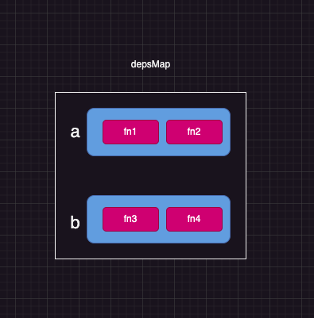

实现简版的 effect

结合 `track` 和 `trigger`

```js
const data = {
  a: 1,
  b: 2,
  c: 3
}

let activeEffect = null

const state = new Proxy(data, {
  get(target, key) {
    track(target, key)
    return target[key]
  },
  set(target, key, value) {
    target[key] = value
    trigger(target, key)
    return true
  }
})

const track = (target, key) => {}

const trigger = (target, key) => {
  console.log(`🚀 ~ 代理对象的set行为被拦截, 操作的属性为:${key}`)
}

const effect = (fn) => {}
// 测试 1
// effect(() => {
//   console.log(state.a)
// })
// 测试 2
// effect(() => {
//   console.log(state)

//   if (state.a === 1) {
//     state.b
//   } else {
//     state.c
//   }
// })

// state.a = 2

// 测试3
// effect(() => {
//   if (state.a === 1) {
//     state.b
//   } else {
//     state.c
//   }
//   console.log('🚀 ~ effect ~ 函数1执行:')
// })
// effect(() => {
//   console.log(state.c)
//   console.log('🚀 ~ effect ~ 函数2执行:')
// })
// state.a = 2

// 测试4
// effect(() => {
//   if (state.a === 1) {
//     state.b
//   } else {
//     state.c
//   }
//   console.log('🚀 ~ effect ~ 函数1执行:')
// })
// effect(() => {
//   console.log(state.a)
//   console.log(state.c)
//   console.log('🚀 ~ effect ~ 函数2执行:')
// })
// state.a = 2
```

1.  effect 实在访问 代理对象上的属性，所以会触发 track 的拦截

    > - 在 track 中, key 可以很方便的拿到 那函数呢?
    >   > 1. 函数通过全局变量保存 所以定义一个 activeEffect 来保存当前的函数.
    >   > 2. 可能会有多个 key 依赖多个函数 所以来一个 map 来保存依赖关系

## v0.1.0

所以代码中修改如下

```js
let activeEffect = null

let depsMap = new Map()
const track = (target, key) => {
  if (activeEffect) {
    const deps = depsMap.get(key) // 根据属性值去拿对应的依赖集合
    if (!deps) {
      depsMap.set(key, (deps = new Set()))
    }
    deps.add(activeEffect) // 将当前关联的函数添加到集合
    console.log(depsMap)
  }
}
const track = () => {
  activeEffect = fn
  fn()
  activeEffect = null
}
```

此时的输出结果为，表明 a 已经被收集到依赖集合中

```js
// Map(1) { 'a' => Set(1) { [Function (anonymous)] } }
```

2. 修改
   `state.a = 2`

```js
const trigger = (target, key) => {
  const deps = depsMap.get(key) // 从集合中拿到对应的依赖重新执行
  if (deps) {
    deps.forEach((effect) => effect())
  }
}
```

### v0.1.0 总结

实现思路如下 `每一个属性对应一个 set 集合`，集合中是所依赖的函数，所有函数及对应的依赖函数集合整理为一个 map 结构

定义 一个 activeEffect 中间变量，来保存这个回掉函数，等依赖收集完成之后在设置为 空



## v0.1.1

```js
// 执行测试 2 的代码
effect(() => {
  console.log(state)

  if (state.a === 1) {
    state.b
  } else {
    state.c
  }
})
state.a = 2
```

两次运行的回掉函数 建立的依赖关系是相同的

应该 第一次是 a、b 第二次是 a、c

但是执行结果如下

```js
🚀 ~ effect ~ 函数执行:
Map(1) { 'a' => Set(1) { [Function (anonymous)] } }
Map(2) {
  'a' => Set(1) { [Function (anonymous)] },
  'b' => Set(1) { [Function (anonymous)] }
}

🚀 ~ effect ~ 函数执行:
Map(2) {
  'a' => Set(1) { [Function (anonymous)] },
  'b' => Set(1) { [Function (anonymous)] }
}
Map(2) {
  'a' => Set(1) { [Function (anonymous)] },
  'b' => Set(1) { [Function (anonymous)] }
}

```

问题分析

第一次建立依赖关系的时候，是将依赖函数赋值给 activeEffect，最终是通过 activeEffect 将依赖函数添加 执行完成后重新赋值为 null

之后属性值变化，重新运行的是回掉函数，但是 activeEffect 值为 null ，所以就导致依赖一直被收集不进去 执行的一直是 如下 callback

```js
;() => {
  console.log('🚀 ~ effect ~ 函数执行:')
  if (state.a === 1) {
    state.b
  } else {
    state.c
  }
}
```

改造方案
在收集依赖的时候, 不再收集依赖函数，而是收集一个包含有 activeEffect 的环境代码,这样就可以保证 activeEffect 一直有值

```js
const effect = (fn) => {
  const environment = () => {
    activeEffect = environment
    fn()
    activeEffect = null
  }
  environment()
}
```

执行结果如下

```js
🚀 ~ effect ~ 函数执行:
Map(1) { 'a' => Set(1) { [Function: environment] } }
Map(2) {
  'a' => Set(1) { [Function: environment] },
  'b' => Set(1) { [Function: environment] }
}
🚀 ~ effect ~ 函数执行:
Map(2) {
  'a' => Set(1) { [Function: environment] },
  'b' => Set(1) { [Function: environment] }
}
Map(3) {
  'a' => Set(1) { [Function: environment] },
  'b' => Set(1) { [Function: environment] },
  'c' => Set(1) { [Function: environment] }
}
```

但是 b 的依赖没有被删除阿 ～～

> 需要清除旧的依赖, 那一个 key 可能在多个 effect 中去使用，所以需要记录这个环境使用了多少次

在 track 的时候就需要进行记录了， 记录环境和集合的关系

万物皆对象 所以给 environment 函数上定义一个 deps -> []

那么在 track 的时候只需要将当前依赖的集合添加就好

代码改造如下

```js
const effect = (fn) => {
  const environment = () => {
    activeEffect = environment
    cleanup()
    fn(environment)
    activeEffect = null
  }
+++  environment.deps = [] // 记录环境函数在哪些集合中使用
  environment()
}


const track = (target, key) => {
  if (activeEffect) {
    let deps = depsMap.get(key) // 根据属性值去拿对应的依赖集合
    if (!deps) {
      depsMap.set(key, (deps = new Set()))
    }
    deps.add(activeEffect) // 将当前关联的函数添加到集合
++++    activeEffect.deps.push(deps) // 将当前的依赖集合添加到环境函数的deps
  }
  console.log(depsMap)
}

const cleanup = (environment) => {
  // 1. 拿到当前环境的依赖
  let deps = environment.deps
  // 2. 遍历依赖，删除依赖
  if (deps.length) {
    deps.forEach((dep) => {
      dep.delete(environment)
      if (dep.size === 0) {
        for (const [key, value] of depsMap) {
          if (value === dep) {
            depsMap.delete(key)
          }
        }
      }
    })
    deps.length = 0
  }
}

```

此时建立的依赖关系为

```js

🚀 ~ effect ~ 函数执行:
Map(1) { 'a' => Set(1) { [Function: environment] { deps: [Array] } } }
Map(2) {
  'a' => Set(1) { [Function: environment] { deps: [Array] } },
  'b' => Set(1) { [Function: environment] { deps: [Array] } }
}
🚀 ~ effect ~ 函数执行:
Map(1) { 'a' => Set(1) { [Function: environment] { deps: [Array] } } }
Map(2) {
  'a' => Set(1) { [Function: environment] { deps: [Array] } },
  'c' => Set(1) { [Function: environment] { deps: [Array] } }
}
```

但是在执行测试 4 的时候 进入到了无限循环

原因:

1. 初始化执行 effect 时，state.a = 1 ，因此第一个 effect 会访问 state.b 第二个 effect 会访问 state.a 和 state.c
2. 当 start.a 修改为 2 时，trigger 函数会触发所有依赖 state.a 的 effect 函数
3. 第二个 effect 被触发后，会访问 state.a 这时 track 函数又会把当前 activeEffect 添加到 state.a 的依赖集合中
4. state.a 被修改，会再次出发 trigger，导致第二个 effect 再次执行，导致无限循环

```js
const trigger = (target, key) => {
  const deps = depsMap.get(key)
  if (deps) {
    const effectsToRun = new Set(deps) // 创建一个新集合，避免无限循环
    effectsToRun.forEach((effect) => effect())
  }
}
```

结果为

```
Map(1) { 'a' => Set(1) { [Function: environment] { deps: [Array] } } }
Map(2) {
  'a' => Set(1) { [Function: environment] { deps: [Array] } },
  'b' => Set(1) { [Function: environment] { deps: [Array] } }
}
🚀 ~ effect ~ 函数1执行:
Map(2) {
  'a' => Set(2) {
    [Function: environment] { deps: [Array] },
    [Function: environment] { deps: [Array] }
  },
  'b' => Set(1) { [Function: environment] { deps: [Array] } }
}
1
Map(3) {
  'a' => Set(2) {
    [Function: environment] { deps: [Array] },
    [Function: environment] { deps: [Array] }
  },
  'b' => Set(1) { [Function: environment] { deps: [Array] } },
  'c' => Set(1) { [Function: environment] { deps: [Array] } }
}
3
🚀 ~ effect ~ 函数2执行:
Map(2) {
  'a' => Set(2) {
    [Function: environment] { deps: [Array] },
    [Function: environment] { deps: [Array] }
  },
  'c' => Set(1) { [Function: environment] { deps: [Array] } }
}
Map(2) {
  'a' => Set(2) {
    [Function: environment] { deps: [Array] },
    [Function: environment] { deps: [Array] }
  },
  'c' => Set(2) {
    [Function: environment] { deps: [Array] },
    [Function: environment] { deps: [Array] }
  }
}
🚀 ~ effect ~ 函数1执行:
Map(2) {
  'a' => Set(2) {
    [Function: environment] { deps: [Array] },
    [Function: environment] { deps: [Array] }
  },
  'c' => Set(1) { [Function: environment] { deps: [Array] } }
```

### v0.1.1 总结

1. 通过 activeEffect 来保存当前的函数，在执行完之后设置为 null
2. 通过 deps 来保存当前函数依赖的集合
3. 通过 cleanup 来清除旧的依赖
4. 通过 trigger 来触发依赖

## v0.0.2 effect 的嵌套

`来自朋友的分享 ～`

```js
// 情况 4
effect(() => {
  effect(() => {
    effect(() => {
      state.c
      console.log('执行了effect3')
    })
    state.a
    console.log('执行了effect2')
  })
  state.b
  console.log('执行了effect1')
})
```

模拟入栈出栈

```js
const effectStack = []
const effect = (fn) => {
  const environment = () => {
    activeEffect = environment
    // 将环境函数入栈
    effectStack.push(environment)
    cleanup(environment)
    fn()
    // 将环境函数出栈
    effectStack.pop()
    activeEffect = effectStack[effectStack.length - 1]
  }
  environment.deps = [] // 记录环境函数在哪些集合中使用
  environment()
}
```
