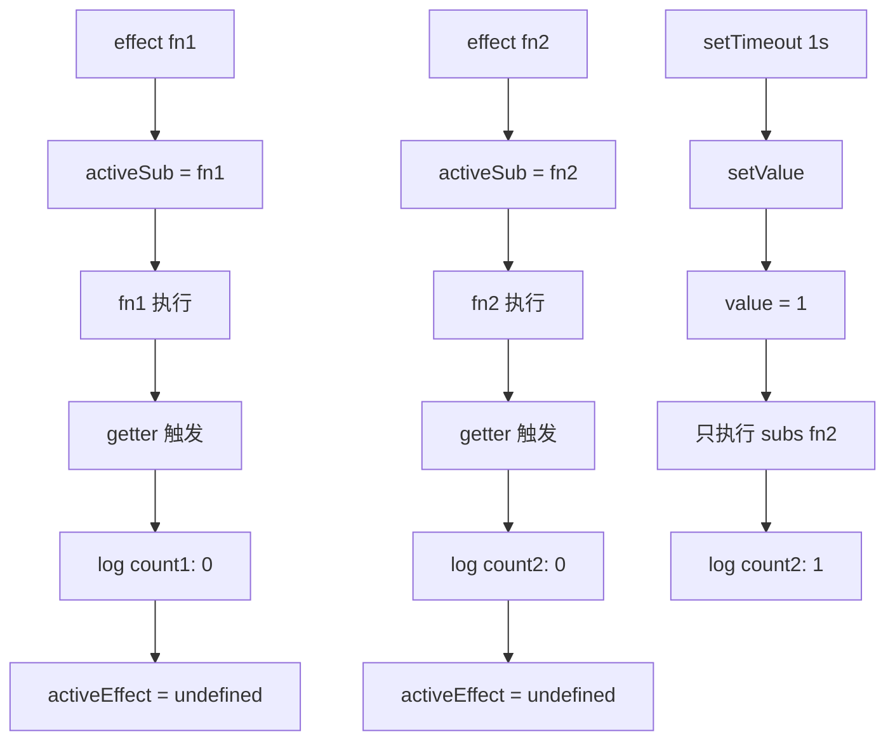
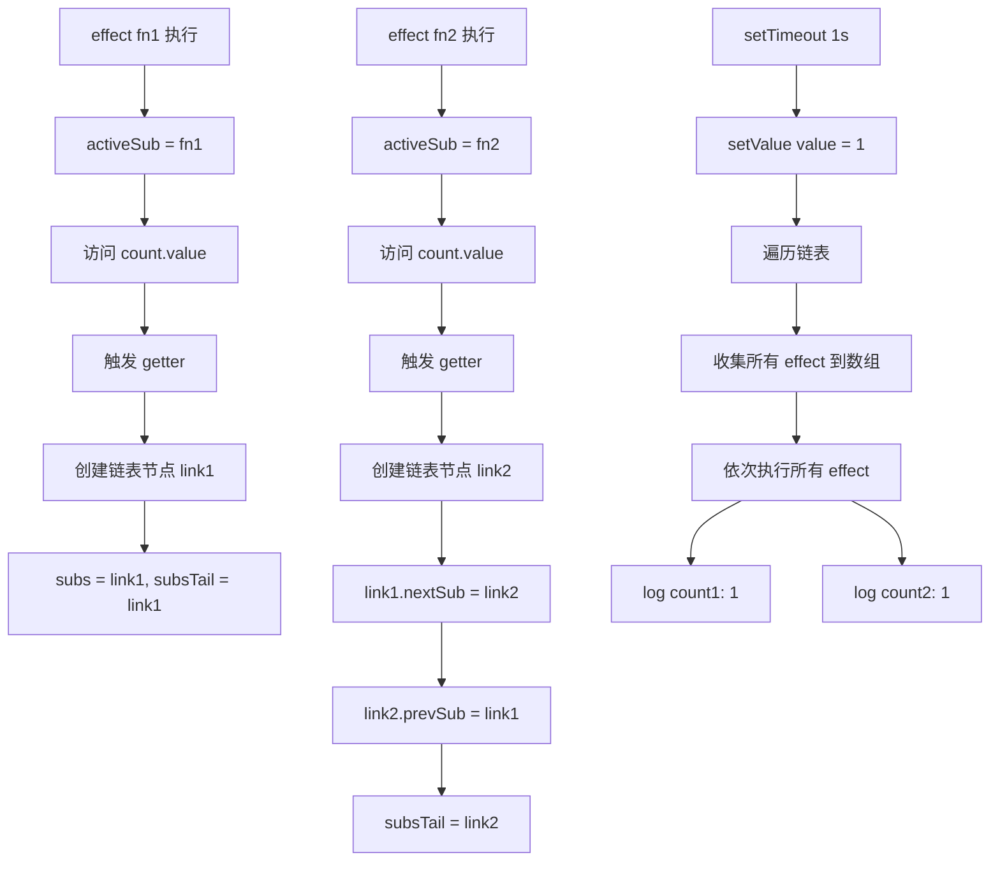

## 问题背景

> 一个响应式数据需要被多个 effect 监听。

```js
import {ref, effect} from '../dist/reactivity.esm.js'

const count = ref(0)

effect(() => {
  console.log('count1 ==> ', count.value)
})

effect(() => {
  console.log('count2 ==> ', count.value)
})

setTimeout(() => {
  count.value = 1
}, 1000)
```

期望：当 `count.value` 改变时，两个 effect 都应该被触发。

---

**基础实现的缺陷**

在简单的响应式实现中，存在一个关键问题：

> **问题**：每次执行 effect 时都会覆盖之前的依赖，导致只有最后一个 effect 能收到更新通知。

**问题代码分析**

```js
get
value()
{
  // 收集依赖
  if (activeSub) {
    this.subs = activeSub
  }
  return this._value
}
```

**执行流程分析**

让我们追踪一下执行过程：



**结果**：只有 `count2` 被打印，`count1` 被"遗忘"了。

```js
set
value(newValue)
{
  this._value = newValue
  this.subs?.()  // 只执行最后一个 effect
}
```

## 解决方案

有了链表的概念之后，需要将链表加入到响应式中，解决多 effect 依赖收集的问题。

---

```ts
import {activeSub} from './effect'

enum ReactiveFlags {
  IS_REF = '__v_isRef'
}

interface Link {
  sub: Function // 保存 effect
  nextSub: Link | undefined // 下一个节点
  prevSub: Link | undefined // 上一个节点
}

class RefImpl {
  _value;

  [ReactiveFlags.IS_REF] = true // 证明是一个 Ref

  /**
   * 订阅者链表的头节点
   */
  subs: Link

  /**
   * 订阅者链表的尾节点
   */
  subsTail: Link | undefined

  constructor(value) {
    this._value = value
  }

  get value() {
    // 收集依赖
    if (activeSub) {
      const newLink: Link = {
        sub: activeSub,
        nextSub: undefined,
        prevSub: undefined
      }

      /**
       * 链表关系关联
       *  1. 如果存在尾节点，往尾节点后面加
       *  2. 如果不存在尾节点，头节点和尾节点相同
       */
      if (this.subsTail) {
        this.subsTail.nextSub = newLink
        newLink.prevSub = this.subsTail
        this.subsTail = newLink
      } else {
        this.subs = newLink
        this.subsTail = newLink
      }
    }
    return this._value
  }

  set value(newValue) {
    // 触发更新
    this._value = newValue

    let link = this.subs
    let queuedEffect = []
    while (link) {
      queuedEffect.push(link.sub)
      link = link.nextSub
    }

    queuedEffect.forEach(effect => effect())
  }
}

export function ref(value) {
  return new RefImpl(value)
}

```

**解决后的流程分析**

使用链表管理依赖后的完整流程：




1. **链表结构管理**：
   - 每个 effect 对应一个链表节点
   - 节点包含：`sub`（effect 函数）、`nextSub`、`prevSub` 指针

2. **依赖收集过程**：
   - 第一个 effect：创建头节点，头尾指针都指向同一节点
   - 后续 effect：在尾部追加新节点，更新尾指针

3. **依赖触发过程**：
   - 遍历整个链表，收集所有 effect 函数
   - 批量执行，确保所有依赖都被触发


**链表状态变化**：

- **初始状态**：`subs = undefined, subsTail = undefined`
- **第一个 effect 后**：`subs = link1, subsTail = link1`
- **第二个 effect 后**：`link1 ↔ link2`，`subsTail = link2`

这样就能保证所有 effect 都能收到更新通知，解决了之前依赖覆盖的问题。