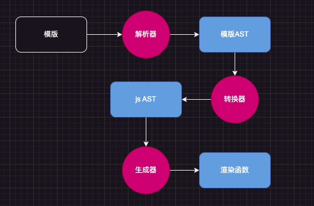
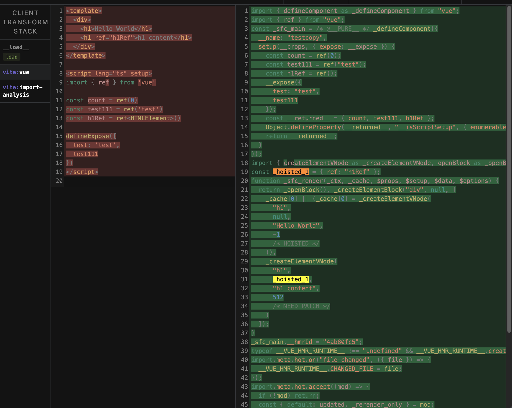

在实际渲染的时候, 模版是会被编译为渲染函数, 渲染函数是执行后返回虚拟 DOM

## 渲染函数

vue 的单文件组件是会被一个 <b>模版编译器</b> 进行编译的，编译后并不存在模版，而是将模版编译为渲染函数的形式

单文件组件只是为了方便开发
在运行的时候是不需要模版的，只需要执行渲染函数后得到的虚拟 DOM，如下的 js 一样可以作为 component 使用

```js
import { ref, watch, defineComponent, h } from 'vue'
import { uploadParams } from '@/constant'
import FileUpload from '@/components/FileUpload/index.vue'

export default defineComponent({
  name: 'file',
  props: {
    initFiles: {
      type: Array,
      default: () => []
    }
  },
  setup(props, { expose }) {
    const uploadedFiles = ref([])

    const delFile = (v) => {
      uploadedFiles.value.splice(v, 1)
    }

    const uploadSuccess = (data) => {
      uploadedFiles.value.push(...data)
    }

    watch(
      () => props.initFiles,
      (newFiles) => {
        uploadedFiles.value = [...newFiles]
      },
      {
        immediate: true
      }
    )
    expose({
      uploadedFiles
    })

    return () => {
      return h(FileUpload, {
        onDelFile: delFile,
        uploadParams: uploadParams,
        onUploadFileCallback: uploadSuccess,
        modelValue: uploadedFiles.value,
        ...props
      })
    }
  }
})
```

## 模版的编译

单文件组件中书写的模版，对于模版编译器来讲，就是一堆字符串

模版编译器对模版字符串进行编译过程


解析器: 解析模版字符串，转换成对应的模版 AST

转换器: 将模版 AST 转化为 js AST

生成器: 将 js AST 转化为渲染函数

点击这里 [astexplorer](https://astexplorer.net/) 可以查看模版编译后的 AST 结构

```vue
<!-- 模版内容 -->
<template>
  <div>
    <h1>hello</h1>
  </div>
</template>
```

```js
// 对于编译器而言
'<template><div><h1>hello</h1></div><template/>'
```

```js
// 编译后
function render() {
  return h('div', [h('h1', 'hello')])
}
```

解析器:

1. 拿到 template 字符串, 对字符串进行解析 拿到 token
2. 根据 token 生成对应的 模版 AST

```js
// 1. 拿到 template 字符串, 对字符串进行解析 拿到 token

let tokens = [
  {
    type: 'tag',
    name: 'div'
  },
  {
    type: 'tag',
    name: 'h1'
  },
  {
    type: 'text',
    content: 'hello'
  }
]
```

2. 根据 token 生成对应的 模版 AST

```json
{
  "type": 1,
  "tag": "template",
  "attrsList": [],
  "attrsMap": {},
  "rawAttrsMap": {},
  "children": [
    {
      "type": 1,
      "tag": "div",
      "attrsList": [],
      "attrsMap": {},
      "rawAttrsMap": {},
      "parent": "[Circular ~]",
      "children": [
        {
          "type": 1,
          "tag": "h1",
          "attrsList": [],
          "attrsMap": {},
          "rawAttrsMap": {},
          "parent": "[Circular ~.children.0]",
          "children": [
            {
              "type": 3,
              "text": "hello",
              "static": true
            }
          ],
          "plain": true,
          "static": true
        }
      ],
      "plain": true,
      "static": true,
      "staticInFor": false,
      "staticRoot": true,
      "staticProcessed": true
    }
  ],
  "plain": true,
  "static": false,
  "staticRoot": false
}
```

---------- 解析器工作完成 ----------

转换器 将 模版 AST 转换为 js AST

```json
{
  "type": "FunctionDecl",
  "id": {
    "type": "Identifier",
    "name": "render"
  },
  "params": [],
  "body": [
    {
      "type": "ReturnStatement",
      "return": {
        "type": "CallExpression",
        "callee": {
          "type": "Identifier",
          "name": "h"
        },
        "arguments": [
          {
            "type": "StringLiteral",
            "value": "div"
          },
          {
            "type": "ArrayExpression",
            "elements": [
              {
                "type": "CallExpression",
                "callee": {
                  "type": "Identifier",
                  "name": "h"
                },
                "arguments": [
                  {
                    "type": "StringLiteral",
                    "value": "hello"
                  }
                ]
              }
            ]
          }
        ]
      }
    }
  ]
}
```

---------- 转换器工作完成 ----------

生成器: 将 js AST 转化为渲染函数

```js

function render = () => {
  return h('div', [h('h1', 'hello')])
}
```

```js
// 大致结构如下
function compile(template) {
  // 解析器
  const ast = parse(template)
  // 转换器
  const jsAst = transform(ast)
  // 生成器
  const code = generate(jsAst)
  return code
}
```

使用了 vite-plugin-inspect 插件，可以查看编译后的 AST 结构

```js
// 使用 vite-plugin-inspect 插件
import { inspect } from 'vite-plugin-inspect'

export default defineConfig({
  plugins: [inspect()]
})
```

1. 拿到 源文件内容
2. 编译
   
3. 将 vue 等依赖文件 nodeModules 引入

<Gitalk />
