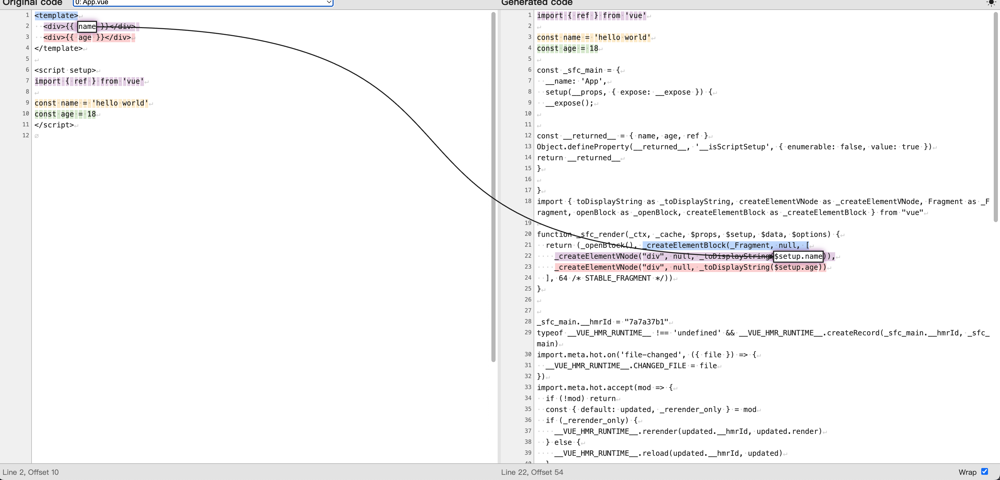

```vue
<template>
  <div>{{ name }}</div>
  <div>{{ age }}</div>
</template>

<script setup>
import { ref } from 'vue'

const name = 'hello world'
const age = 18
</script>
```

在这个代码中 模版用到了两个响应式数据，相当于读取了 value 属性，产生了属性的拦截，就会和对应的 render 关联，存在了依赖关系

当有了依赖关系后，响应式数据的变化就会重新触发 render，拿到最新的 VDom，去更新真实 DOM，在视觉上达到界面的更新



在 setup 函数中 定义了 name、age 属性，会转化为 \_returned\_ 的一个访问器，针对这两个属性进行了代理，在进行读取和赋值的时候就会被拦截到

在 \_sfc_render 函数中, 通过 $setup 参数 访问了两个属性，发生了对读取行为的拦截，建立了依赖关系
<Gitalk />
