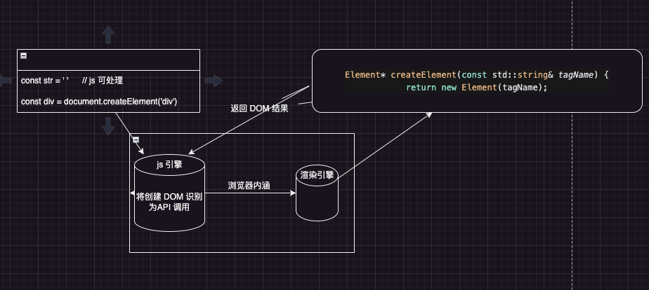

为什么要有虚拟 DOM，得先了解 DOM 的工作原理

## DOM 工作原理

js 代码是运行在浏览器中的,浏览器是 C++ 写的

```js
const div = document.createElement('div')
```

是如何处理的呢?

`web interface definition language` WebIDL：翻译成中文也就是 `web 接口定义语言`, 就是定义浏览器和 js 之间的通信

也就是浏览器（C++）提供的一些功能（本地功能）如何能被 js 调用

通过 WebIDL , <b>浏览器开发者</b> 可以描述哪些类和方法被 js 调用及映射到 js 中的对象和方法。

```c++
interface Document {
  Element createElement(DOMString tagName);
}
```

定义了一个 Document 的接口, 内部又一个 createElement, 用来创建 dom 元素

随后 <b>浏览器开发者</b> 实现这个接口 ()

```c++
class Document {
 public:
 // 实现了 Document 接口的 createElement 方法，定义了如何来创建 DOM 元素
 Element* createElement(const std::string& tagName) {
  return new Element(tagName);
 }
}
```

生成绑定代码, 绑定了 js 如何调用 C++ 方法

```c++
// AI 生成的代码
// 这个绑定代码 是由 WebIDL 自动生成的
// 也就是 js 到 C++ 的绑定代码
void Document_createElement(const v8::FunctionCallbackInfo<v8::Value>& args) {
 v8::Isolate* isolate = args.GetIsolate();
 v8::HandleScope scope(isolate);

 // 获取 tagName 参数
 std::string tagName = args[0]->ToString();
 // 创建 Element 对象
 Element* element = new Element(tagName);
 // 将 Element 对象返回给 js
 args.GetReturnValue().Set(element);
}
```

有了绑定代码之后就需要在 js 引擎 去注册了

```c++
// 在 js 引擎中注册
void RegisterDocument(v8::Isolate* isolate) {
 v8::Local<v8::FunctionTemplate> documentTemplate = v8::FunctionTemplate::New(isolate, Document_createElement);
 v8::Local<v8::ObjectTemplate> documentObjectTemplate = documentTemplate->InstanceTemplate();
 documentObjectTemplate->SetInternalFieldCount(1);
 v8::Local<v8::Object> documentObject = documentObjectTemplate->NewInstance(isolate->GetCurrentContext()).ToLocalChecked();
}
```

<b> web 开发者就可以在 js 中书写如下代码：</b>

```js
const str = 'div'
const div = document.createElement('div')
```

第一句代码 js 是完全可以支持的

第二句 js 引擎会将它识别为 API 调用，想浏览器发出请求，由浏览器来创建 DOM 元素，创建完 dom 元素后，会给 js 代码中返回一个结果

如下图:



## 虚拟 DOM 的本质

虚拟 DOM 最开始的时候是由 react 提出来的

> 虚拟 DOM 是一种编程概念。 在这个概念里，UI 以一种 “虚拟的”形式保存在内存中

vue 中的虚拟 DOM

```js

import { h } from 'vue'

const vnode = h(helloWorld)

// vnode 的结构
{
  anchor: null
  appContext: null
  children: null
  component: null
  ctx: null
  dirs: null
  dynamicChildren: null
  dynamicProps: null
  el: null
  key: null
  patchFlag: 0
  props: null
  ref: null
  scopeId: null
  shapeFlag: 4
  slotScopeIds: null
  ssContent: null
  ssFallback: null
  staticCount: 0
  suspense: null
  target: null
  targetAnchor: null
  targetStart: null
  transition: null,
  type: {
    props: {},
    setup:() => {},
    render:() => {}
  }
}
```

结论： 虚拟 DOM 的本质就是 js 对象

## 使用虚拟 DOM 的原因

最开始的时候，都是通过手动操作 DOM 的方式来创建节点的

```js
// 节点增删改查

// 增
const div = document.createElement('div')
div.id = 'app'
const content = document.createTextNode('hello')
div.appendChild(content)
document.body.appendChild(div)

const app = document.getElementById('app')

// 删
const parent = app.parentNode
parent.removeChild(app)

// 改
app.textContent = 'world'
app.style.color = 'red'

// 插入
insertBefore
const node = document.createElement('div')
node.textContent = 'new content'
app, parent.insertBefore(node, app)
```

这种代码的性能一定是最高的

这意味着如果要创建 div 节点, 没有比 document.createElement('div') 更快的了

但是在实际开发中 使用的都是更加方便的方式。 比如

```html
<div id="app">
  <!-- 加入一些其他节点 -->
</div>
```

如果是传统的方式话

```js
const app = document.getElementById('app')

const messageDiv = document.createElement('div')

messageDiv.className = 'message'

const infoDiv = document.createElement('div')

infoDiv.className = 'info'

//  创建 其他 div 及 其他节点
app.appendChild(messageDiv)
app.appendChild(infoDiv)
```

如果使用 innerHTML 的话

```js
app.innerHTML = '
<div class="message">hello</div>
<div class="info">world</div>
'
```

虽然第一种方式性能最高，但是开发者的心智负担也很高

所以 选择第二种 虽然性能差一些 但是轻松阿 🤔

<b>所以性能差在哪？</b>

第二种方式涉及到了两个层面的计算

> 1. 解析字符串 （js 层面）
> 2. 创建对应的 DOM 节点 (DOM 层面)

在不同层面的计算中, js 层面的计算和 DOM 层面的计算 速度是完全不同的

在 js 层 创建 一千万个 对象

```js
console.time('time')
const arr = []
for (let i = 0; i < 10000000; i++) {
  const div = { a: 1 }
  arr.push(div)
}
console.timeEnd('time')

//  170 - 200ms 左右
```

在 DOM 层面 创建 一千万个 节点

```js
console.time('time')
const arr = []
for (let i = 0; i < 10000000; i++) {
  const div = document.createElement('div')
  arr.push(div)
}
console.timeEnd('time')
// 2000+ms
```

因为 document.createElement('div') 还会被识别为 API 调用 等待渲染引擎返回结果 所以 性能差距很大

虚拟 DOM 的优势是在更新的时候， 在初始化渲染的时候差距不大

```html
<!DOCTYPE html>
<html lang="en">
  <head>
    <meta charset="UTF-8" />
    <meta name="viewport" content="width=device-width, initial-scale=1.0" />
    <title>Document</title>
  </head>
  <body>
    <div class="container"></div>
    <button id="update">update</button>

    <script>
      const container = document.querySelector('.container')
      const update = document.querySelector('#update')

      update.addEventListener('click', () => {
        container.innerHTML = new Date().toLocaleString()
      })
    </script>
  </body>
</html>
```

在这个代码中, 涉及到的计算层面

> 1. 销毁旧的 DOM 节点(DOM 层面)
> 2. 解析新字符串(js 层面)
> 3. 创建新的 DOM 节点(DOM 层面)

如果使用 虚拟 DOM 的话， 只有两个层面的计算:

> 1. 通过 diff 算法 来计算出需要更新的 DOM 节点(js 层面)
> 2. 通过 patch 算法 来更新 DOM 节点(DOM 层面)

#### 虚拟 DOM 快的错觉

- 虚拟 DOM 和原生 js 操作 DOM 比较，虚拟 DOM 性能更低,因为多了一层计算
- 虚拟 DOM 和 innerHTML 比较

  - 初始化时两者的差距不大
  - 在更新的时候比 innerHTML 性能更高

#### 总结

1. 防止组件在 重新渲染的时候 频繁的销毁和创建 DOM 节点，导致的性能问题
2. 跨平台

> 虚拟 DOM 其实增加了一层抽象层, 相当于和底层 DOM 操作解耦

- 可以通过不同的渲染引擎进行渲染, 比如 小程序, 桌面应用, 移动应用等

3. 可以实现 SSR

<Gitalk />
