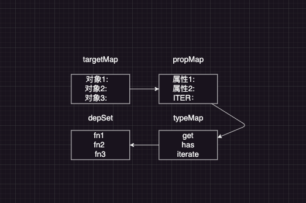

整合一下之前的代码

```js
// handle/index.js

import reactive from '../reactive.js'
import {
  isObject,
  trackTypes,
  triggerTypes,
  hasChanged,
  RAW
} from '../utils/index.js'

import track, { resumeTracking, pauseTracking } from '../effect/track.js'
import trigger from '../effect/trigger.js'

const arrayInstrumentations = {}

;['includes', 'indexOf', 'lastIndexOf'].forEach((method) => {
  arrayInstrumentations[method] = function (...args) {
    const res = Array.prototype[method].apply(this, args)
    if (res === -1 || res === false) {
      // 2. 如果找不到，则使用原始值，而不是代理的对象
      return Array.prototype[method].apply(this[RAW], args)
    }
    return res
  }
})
;['push', 'poo', 'shift', 'unshift', 'splice'].forEach((method) => {
  arrayInstrumentations[method] = function (...args) {
    pauseTracking() // 暂停依赖收集
    const res = Array.prototype[method].apply(this, args)
    resumeTracking() // 恢复依赖收集
    return res
  }
})

function getHandler(target, key) {
  // 增加自定义标识，返回原始对象 避免和已有属性重复
  if (key === RAW) {
    return target
  }
  track(target, trackTypes.GET, key)

  if (arrayInstrumentations.hasOwnProperty(key) && Array.isArray(target)) {
    return arrayInstrumentations[key]
  }

  const result = Reflect.get(target, key)
  return isObject(result) ? reactive(result) : result
}

function ownKeysHandler(target) {
  track(target, trackTypes.ITERATE)
  return Reflect.ownKeys(target)
}

function setHandler(target, key, value) {
  //  类型是 新增 还是 修改
  const type = target.hasOwnProperty(key) ? triggerTypes.SET : triggerTypes.ADD
  const oldValue = target[key]

  const ordLength = Array.isArray(target) ? target.length : undefined
  const result = Reflect.set(target, key, value)

  if (hasChanged(value, oldValue)) {
    trigger(target, type, key, value)

    // 判断 length 是否有变化，如果有变化 手动对 length 派发更新

    if (Array.isArray(target) && ordLength !== target.length) {
      //  length 隐式的改变还会触发一次
      if (key !== 'length') {
        trigger(target, triggerTypes.SET, 'length')
      } else {
        // 说明 length 显式的发生了改变
        for (let i = target.length; i < ordLength; i++) {
          trigger(target, triggerTypes.DELETE, i.toString())
        }
      }
    }
  }

  return result
}

function hasHandler(target, key) {
  track(target, trackTypes.HAS, key)
  return Reflect.has(target, key)
}

function deleteHandler(target, key) {
  // 不能每次都直接触发 先判断属性是否存在
  const hasKey = target.hasOwnProperty(key)
  const result = Reflect.deleteProperty(target, key)
  if (hasKey) {
    trigger(target, triggerTypes.DELETE, key)
  }
  return result
}

export default {
  get: getHandler,
  ownKeys: ownKeysHandler,
  has: hasHandler,
  set: setHandler,
  deleteProperty: deleteHandler
}
```

```js
// utils/

// index.js
export { default as isObject } from './isObject.js'
export { default as hasChanged } from './hasChanged.js'
export const trackTypes = {
  GET: 'get',
  HAS: 'has',
  ITERATE: 'iterate'
}

export const triggerTypes = {
  SET: 'set',
  ADD: 'add',
  DELETE: 'delete'
}

export const RAW = Symbol('raw')

export const ITERATE_KEY = Symbol('iterate')


export default function hasChanged(value, oldValue) {
  return !Object.is(value, oldValue)
}


export default function isObject(value) {
  return typeof value === 'object' && value !== null
}

```

```js
// effect/effect.js
// 稍微改造一下 和_02 差不多

export let activeEffect = null
export const targetMap = new WeakMap()

const effectStack = []

/**
 * 执行传入的函数，并在执行的过程中去收集依赖
 * @param {Function} fn 要执行的函数
 */
export const effect = (fn, options = {}) => {
  const { lazy = false } = options
  const environment = () => {
    try {
      activeEffect = environment
      effectStack.push(environment)

      return fn()
    } finally {
      effectStack.pop()
      activeEffect = effectStack[effectStack.length - 1] || null
    }
  }
  environment.deps = []
  environment.options = options
  if (!lazy) {
    environment()
  }
  return environment
}

export const cleanup = (environment) => {
  const deps = environment.deps // 拿到当前环境的依赖
  if (deps.length) {
    deps.forEach((dep) => dep.delete(environment))
    deps.length = 0
  }
}
```

effect 的执行是现在 track 收集完依赖后 改造 track.js

```js
// track.js
import { targetMap, activeEffect } from './effect.js'
import { trackTypes, ITERATE_KEY } from '../utils/index.js'
// 是否需要收集依赖
let shouldTrack = true

/**
 * 暂停依赖收集
 */
export function pauseTracking() {
  shouldTrack = false
}

/**
 *  恢复依赖收集
 */
export function resumeTracking() {
  shouldTrack = true
}

function track(target, type, key) {
  if (!shouldTrack || !activeEffect) return false

  // 一层一层的去找，找到了就存储
  let propertyMap = targetMap.get(target)
  if (!propertyMap || !activeEffect) {
    targetMap.set(target, (propertyMap = new Map()))
  }

  // 如果是遍历所有属性，key 会是一个 undefined
  if (type === trackTypes.ITERATE) {
    key = ITERATE_KEY
  }

  let typeMap = propertyMap.get(key)
  if (!typeMap) {
    propertyMap.set(key, (typeMap = new Map()))
  }

  // 根据 type 值 找对应的 set
  let depSet = typeMap.get(type)
  if (!depSet) {
    typeMap.set(type, (depSet = new Set()))
  }

  // 如果当前的 activeEffect 没有被收集过，则收集
  if (!depSet.has(activeEffect)) {
    depSet.add(activeEffect)
    activeEffect.deps.push(depSet)
  }
}

export default track
```

```js
// trigger.js
import { triggerTypes, trackTypes, ITERATE_KEY } from '../utils/index.js'
import { activeEffect, targetMap } from './effect.js'

const triggerTypeMap = {
  [triggerTypes.SET]: [trackTypes.GET],
  [triggerTypes.ADD]: [trackTypes.GET, trackTypes.HAS, trackTypes.ITERATE],
  [triggerTypes.DELETE]: [trackTypes.GET, trackTypes.HAS, trackTypes.ITERATE]
}

function trigger(target, type, key, value) {
  // 找到对应的依赖，然后执行
  const effectFns = getEffectFns(target, type, key)
  if (!effectFns) return
  for (const effectFn of effectFns) {
    if (activeEffect === effectFn) {
      continue
    }
    // 说明传入了 scheduler，自己来处理依赖的函数
    if (effectFn?.options?.scheduler) {
      effectFn.options.scheduler(effectFn)
    } else {
      effectFn()
    }
  }
}

/**
 * 找到对应的依赖集合
 * @param {*} target
 * @param {*} type
 * @param {*} key
 * @returns
 */
const getEffectFns = (target, type, key) => {
  const propertyMap = targetMap.get(target)
  if (!propertyMap) return

  // 如果是新增或者删除，会额外触发迭代
  const keys = [key]
  if (type === triggerTypes.ADD || type === triggerTypes.DELETE) {
    keys.push(ITERATE_KEY)
  }

  const effectFns = new Set() // 存储依赖的函数

  for (const key of keys) {
    const typeMap = propertyMap.get(key)
    if (!typeMap) {
      continue
    }
    const trackTypes = triggerTypeMap[type]
    for (const trackType of trackTypes) {
      const dep = typeMap.get(trackType)
      if (!dep) {
        continue
      }
      dep.forEach((effectFn) => effectFns.add(effectFn))
    }
  }

  return effectFns
}

export default trigger
```

是什么意思捏 来一张图



- targetMap 存放的是属性之间的映射关系
- propMap 是对象下属性的一个映射关系，有个特殊的属性（ITER） 是在遍历的时候
- typeMap 是操作类型的一个 map，针对属性的操作行为
- depSet 存放的是依赖函数

track 实现的是什么呢。

就是根据结构一层一层去寻找 然后存储

## lazy

懒执行，不期望自动去收集依赖

```js
// effect.js
if (!lazy) {
  environment()
}
```

## scheduler

是否需要进行派发更新 手动控制

```js
const obj = {
  a: 1,
  b: 2
}

const state = reactive(obj)

let isRun = false
const fn = () => {
  console.log('🚀 ~ fn ~ fn:')
  state.a = state.a + 1
}
// 这样的话就只会执行两次
const effectFn = effect(fn, {
  lazy: true,
  scheduler: (fn) => {
    Promise.resolve().then(() => {
      if (!isRun) {
        isRun = true
        fn()
      }
    })
  }
})

effectFn()

state.a++
state.a++
state.a++
state.a++
state.a++
```
